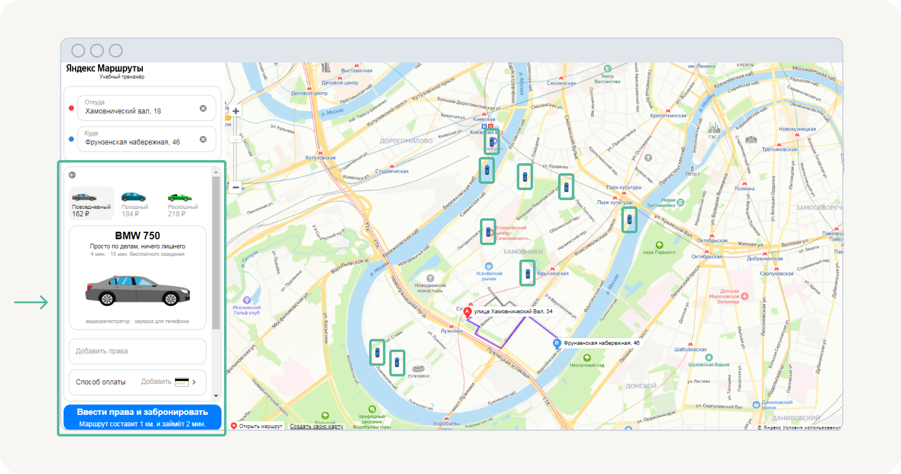
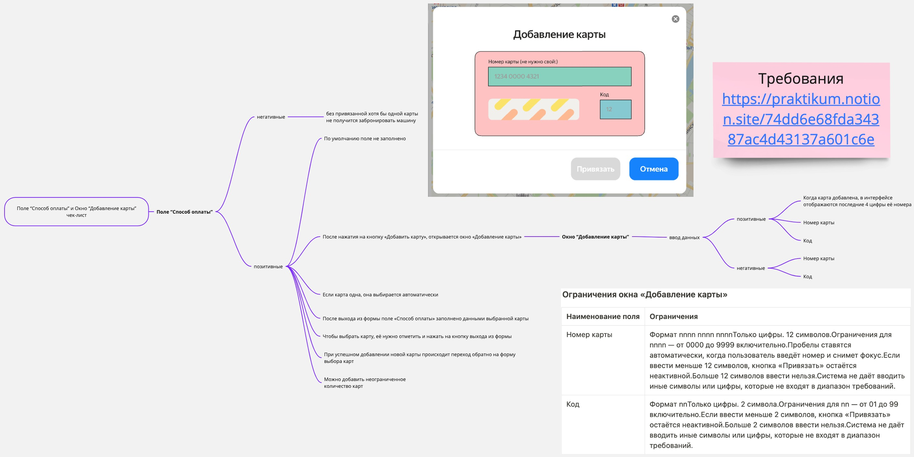
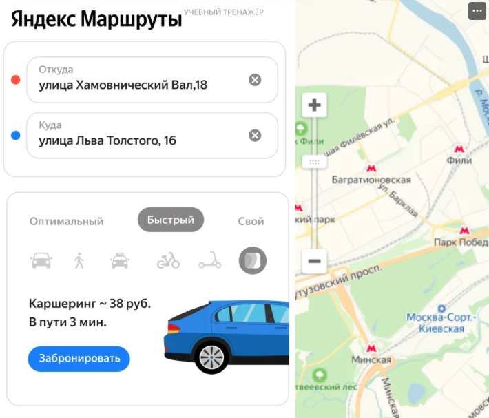

# 2-й спринт, расширенное тестирование Веб: вёрстка полей и логика работы окон функции каршеринга учебного сервиса "ЯндексМаршруты"

## Описание проекта
Проект второго спринта посвящен тестированию функции каршеринга в приложении "ЯндексМаршруты". Задача включала тестирование вёрстки полей бронирования и логики работы окон. Были созданы чек-листы и тест-кейсы для проверки формы бронирования, кнопки "Забронировать", а также окон "Способ оплаты" и "Добавление карты". 

### Основные задачи
- Разработать чек-лист на вёрстку полей бронирования и элементов навигационной карты (иконки автомобилей, действия с ними).
- Составить чек-листы для логики окон "Способ оплаты" и "Добавление карты".
- Создать тест-кейсы для кнопки "Забронировать" с учетом позитивных и негативных проверок.
- Протестировать функционал в двух окружениях: Яндекс Браузер (800x600) и Firefox (1920x1080), отметить результаты проверок, создать баг-репорты.

## Артефакты проекта

### Документация тестирования
- [Чек-листы и тест-кейсы в Google Sheets](https://docs.google.com/spreadsheets/d/1YeSfuql84nXHkQjYW_UmI9da_rHDo7rzq4yPTS8c7C0/edit?usp=sharing) — включает чек-листы на вёрстку и логику окон, тест-кейсы на кнопку "Забронировать".

### Баг-репорты
- Все баги были задокументированы в [YouTrack](https://youtrack.example.com/your-project) и включены в таблицу результатов тестирования.

## Скриншоты и макеты
  
  
  
  
  

## Инструменты и технологии
- Google Sheets для ведения тест-кейсов и чек-листов
- YouTrack для заведения багов
- DevTools для настройки окружения и проверки адаптивности
- Charles для анализа сетевых запросов
- Яндекс Браузер и Firefox для тестирования в разных окружениях

## Выводы и достижения
- В ходе тестирования выявлено X критичных и Y менее значительных багов. Все дефекты задокументированы и переданы разработчикам.
- В ходе работы была создана тестовая документация, включающая проверку вёрстки и логики интерфейса, что позволит продолжить улучшение сервиса "ЯндексМаршруты".
